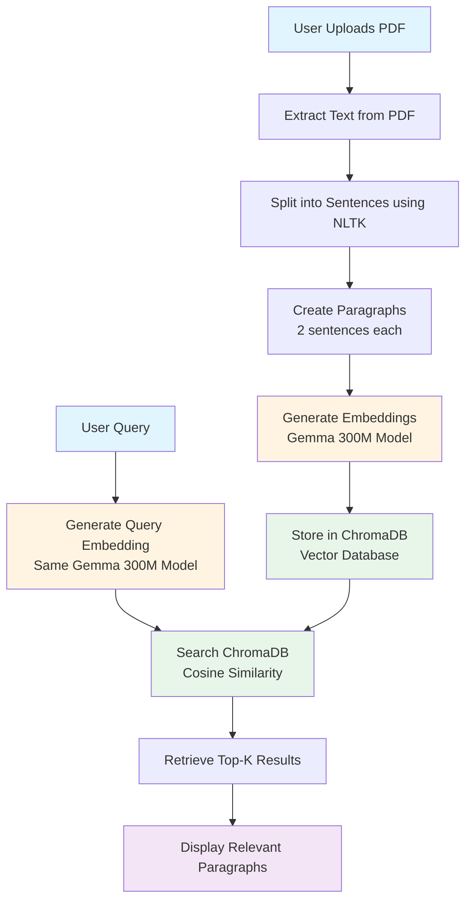

# 📚 PDF Semantic Search App with RAG Pipeline

**Repository**: `rag_on_pdf`

A simple, local RAG (Retrieval-Augmented Generation) pipeline that allows you to upload PDF documents, extract text, generate embeddings using Google's Gemma 300M model, store them in ChromaDB, and perform semantic search using natural language queries.

**Perfect for students and developers** who want to understand how RAG works by building it from scratch on their local computer.

## ✨ Features

- 🔍 **Semantic Search**: Find relevant content by meaning, not just keywords
- 📄 **PDF Processing**: Extract and process text from PDF documents
- 🤖 **Local Embeddings**: Uses Google's Gemma 300M embedding model (runs entirely on your machine)
- 💾 **Persistent Storage**: ChromaDB stores embeddings locally (no cloud required)
- 🎯 **Smart Chunking**: Automatically splits documents into 2-sentence paragraphs for optimal search
- 🚀 **GPU Support**: Automatically detects and uses GPU if available
- 🎨 **User-Friendly UI**: Built with Streamlit for easy interaction
- 🔒 **Privacy-First**: All processing happens locally - your documents never leave your computer

## 🎓 What is RAG?

RAG (Retrieval-Augmented Generation) combines:
1. **Retrieval**: Finding relevant information from documents
2. **Augmented Generation**: Using that information to provide better answers

This app demonstrates a simple RAG pipeline:
```
PDF → Extract Text → Create Chunks → Generate Embeddings → Store in Vector DB
                                                                    ↓
User Query → Generate Query Embedding → Search Vector DB → Retrieve Relevant Chunks
```

## 📋 Prerequisites

Before you begin, ensure you have:

- **Python 3.8+** installed
- **~2GB free disk space** (for the embedding model)
- **A Hugging Face account** (free - [sign up here](https://huggingface.co/join))
- **Basic Python knowledge** (helpful but not required)

## 🔧 Installation

### Step 1: Clone or Download

Clone this repository or download the files:
```bash
git clone https://github.com/mrgehlot/rag_on_pdf.git
cd rag_on_pdf
```

Or if you have SSH set up:
```bash
git clone git@github.com:mrgehlot/rag_on_pdf.git
cd rag_on_pdf
```

### Step 2: Create Virtual Environment (Recommended)

```bash
# Create virtual environment
python -m venv venv

# Activate virtual environment
# On Windows:
venv\Scripts\activate
# On macOS/Linux:
source venv/bin/activate
```

### Step 3: Install Dependencies

```bash
pip install -r requirements.txt
```

This will install:
- `streamlit` - Web interface
- `PyMuPDF` - PDF text extraction
- `transformers` - Hugging Face transformers library
- `chromadb` - Vector database
- `torch` - PyTorch for model inference
- `nltk` - Natural language processing
- `python-dotenv` - Environment variable management
- `datasets` - Dataset utilities
- `huggingface_hub` - Hugging Face model hub

### Step 4: Accept Model License

**Important:** Before running the app, you must accept Google's usage license for the EmbeddingGemma model.

1. **Create a Hugging Face account** (if you don't have one):
   - Visit [https://huggingface.co/join](https://huggingface.co/join)
   - Sign up for a free account

2. **Accept the model license**:
   - Go to the [EmbeddingGemma 300M model card](https://huggingface.co/google/embeddinggemma-300m)
   - Make sure you're logged in
   - Click the button to review and accept Google's usage license
   - The acceptance is processed immediately

**Note:** If you skip this step, you'll get an error when trying to load the model. The error message will guide you to accept the license.

### Step 5: Download NLTK Data (Automatic)

The app will automatically download required NLTK data on first run. If you encounter issues, you can manually download:

```python
import nltk
nltk.download('punkt_tab')
```

## 🚀 Usage

### Starting the App

```bash
streamlit run pdf_search_app.py
```

The app will open in your default web browser at `http://localhost:8501`

### Using the App

1. **Initialize Model & Database**:
   - Click the "Initialize Model & Database" button in the sidebar
   - On first run, this will download the Gemma 300M model (~300MB, one-time download)
   - Wait for the initialization to complete

2. **Upload PDF**:
   - Click "Choose a PDF file" in the main area
   - Select your PDF document
   - Click "Process PDF"
   - Wait for processing to complete (progress bar will show status)

3. **Search**:
   - Enter your natural language query in the search box
   - Adjust the number of results (1-10) using the slider
   - Click "Search"
   - View relevant paragraphs ranked by similarity

### Example Queries

- "What is the main topic of this document?"
- "Explain machine learning concepts"
- "What are the key findings?"
- "Summarize the introduction"

## 📁 Project Structure

```
.
├── pdf_search_app.py          # Main Streamlit application
├── requirements.txt           # Python dependencies
├── README.md                  # This file
├── chroma_db/                 # ChromaDB storage (created automatically)
└── .env                       # Environment variables (optional)
```

## 🏗️ Architecture

The following diagram illustrates the complete RAG pipeline architecture:



### Pipeline Flow

**Document Processing (Indexing):**
1. PDF → Text Extraction
2. Text → Sentence Splitting
3. Sentences → Paragraph Chunking
4. Paragraphs → Embedding Generation
5. Embeddings → Vector Storage (ChromaDB)

**Query Processing (Retrieval):**
1. User Query → Query Embedding
2. Query Embedding → Similarity Search
3. Similarity Search → Top-K Results
4. Results → Display to User

## 🔍 How It Works

### 1. Text Extraction
- Uses PyMuPDF to extract text from PDF files
- Handles multi-page documents

### 2. Sentence Splitting
- Uses NLTK for intelligent sentence tokenization
- Handles complex cases (abbreviations, decimals, etc.)

### 3. Chunking
- Creates paragraphs of 2 sentences each
- Balances context with granularity for optimal search

### 4. Embedding Generation
- Uses Google's Gemma 300M model to generate embeddings
- Converts text to 768-dimensional vectors
- Runs locally on your CPU or GPU

### 5. Vector Storage
- Stores embeddings in ChromaDB (local vector database)
- Each PDF gets its own collection
- Persistent storage (survives app restarts)

### 6. Semantic Search
- Converts query to embedding using the same model
- ChromaDB finds most similar embeddings using cosine similarity
- Returns top-k most relevant paragraphs

## ⚙️ Configuration

### GPU Support

The app automatically detects and uses GPU if available. To check:

```python
import torch
print(torch.cuda.is_available())  # True if GPU available
```

### Changing Chunk Size

To modify the number of sentences per paragraph, edit `pdf_search_app.py`:

```python
paragraphs = create_paragraphs(sentences, sentences_per_paragraph=2)  # Change 2 to desired number
```

### ChromaDB Storage Location

By default, ChromaDB stores data in `./chroma_db`. To change this:

```python
client = chromadb.PersistentClient(
    path="./your_custom_path",  # Change this
    settings=Settings(anonymized_telemetry=False)
)
```

## 🐛 Troubleshooting

### Error: "Resource punkt_tab not found"

**Solution:** The app will try to download NLTK data automatically. If it fails:

```python
import nltk
nltk.download('punkt_tab')
```

### Error: "HF_TOKEN not found" or Model License Error

**Solution:** 
1. Make sure you've accepted the model license on [Hugging Face](https://huggingface.co/google/embeddinggemma-300m)
2. You're logged into your Hugging Face account
3. Try logging in via command line:
   ```bash
   huggingface-cli login
   ```

### Error: "CUDA out of memory"

**Solution:** 
- The app will automatically fall back to CPU
- For large PDFs, process in smaller batches
- Close other GPU-intensive applications

### Model Download Fails

**Solution:**
- Check your internet connection
- Ensure you have ~300MB free disk space
- Try downloading manually from [Hugging Face](https://huggingface.co/google/embeddinggemma-300m)

### Slow Processing

**Solutions:**
- Use GPU if available (much faster)
- Reduce chunk size for faster embedding generation
- Process smaller PDFs first to test

## 📊 Performance

- **Model Size**: ~300MB
- **Memory Usage**: ~1-2GB RAM
- **Processing Speed**: 
  - CPU: ~1-2 seconds per paragraph
  - GPU: ~0.1-0.5 seconds per paragraph
- **Storage**: ~10-50MB per PDF (depending on size)

## 🎯 Use Cases

- **Research**: Search through academic papers and documents
- **Documentation**: Find relevant sections in technical documentation
- **Study**: Quickly find information in textbooks and study materials
- **Knowledge Base**: Build a searchable knowledge base from PDFs
- **Learning**: Understand how RAG and semantic search work

## 🔬 Experiment Ideas

1. **Change Chunk Size**: Try 1, 3, or 5 sentences per paragraph
2. **Multiple PDFs**: Process and search across multiple documents
3. **Different Models**: Try other embedding models from Hugging Face
4. **Add Metadata**: Store page numbers, dates, or other metadata
5. **Hybrid Search**: Combine keyword search with semantic search

## 📚 Resources

- [Streamlit Documentation](https://docs.streamlit.io/)
- [EmbeddingGemma 300M Model Card](https://huggingface.co/google/embeddinggemma-300m)
- [ChromaDB Documentation](https://docs.trychroma.com/)
- [NLTK Documentation](https://www.nltk.org/)
- [Hugging Face Transformers](https://huggingface.co/docs/transformers/)

## 🤝 Contributing

This is a learning project! Feel free to:
- Fork the repository
- Add new features
- Improve the UI
- Fix bugs
- Share your experiments

## 📝 License

This project uses:
- **EmbeddingGemma 300M**: Licensed under [Google's Gemma Terms](https://huggingface.co/google/embeddinggemma-300m)
- **Code**: Feel free to use and modify for learning purposes

## 🙏 Acknowledgments

- **Google DeepMind** for the EmbeddingGemma model
- **Hugging Face** for model hosting and transformers library
- **ChromaDB** for the vector database
- **Streamlit** for the web framework

## 💡 Tips for Students

1. **Start Small**: Test with a small PDF first
2. **Experiment**: Try different chunk sizes and queries
3. **Read the Code**: Understanding the code is more valuable than just running it
4. **Break Things**: Don't be afraid to modify and experiment
5. **Ask Questions**: RAG is complex - it's okay to have questions!

## 🆘 Support

If you encounter issues:
1. Check the [Troubleshooting](#-troubleshooting) section
2. Review error messages carefully
3. Ensure all prerequisites are met
4. Check that you've accepted the model license

## 📧 Contact

For questions, issues, or contributions:
- **Email**: [abhigelot123@gmail.com](mailto:abhigelot123@gmail.com)
- **Repository**: [rag_on_pdf](https://github.com/mrgehlot/rag_on_pdf)
- **Issues**: Please open an issue on the repository for bug reports or feature requests

---

**Happy Searching!** 🔍📚

Built with ❤️ for students learning RAG and semantic search.

